# FitPredict 💪
This is our repository for Group 88's CSC207 Final Project.
This project allows users to make fitness predictions based on their current, daily fitness stats.
Below, we will include a description of how to run and use it.

## How To Run & Open
You will first need to download the `main` branch of this repository. 
After it is downloaded, open `src/main/java/Main.java`.
This is the main file of the project, where the UI screen can be run from. 
After opening this file, right-click on any part of the code and click `Run 'Main.main()'`, as shown in the picture:

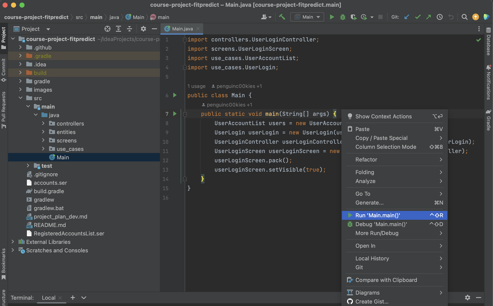

This will run the program. The program screen should pop up and prompt you to enter login information or create a new account. 

If the program does not compile, you may need to change the runner. 
To do this, go to the IntelliJ `Settings > Build, Execution, Deployment > Build Tools > Maven > Gradle` or `Preferences > Build, Execution, Deployment > Build Tools > Maven > Gradle`.
In the `Build and run section`, select `IntelliJ IDEA` for both `Build and run using` and `Run tests using`.
This should fix things.
Now, re-run the program!

## How To Use
Next, we will go over how to use the program's features. 
After running `Main.main()` in `src/main/java/Main.java`, the Login & Create Account screen will pop up:

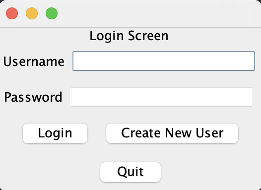

To create a new user, click the `Create New User` button. This will take you to the Account Creation screen:

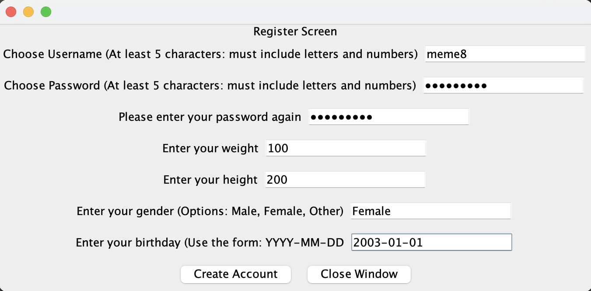

Enter your information into the text fields provided. You need to input:
1. **Username**: at least 5 characters with letters and numbers.
2. **Password**: at least 5 characters with letters and numbers.
3. **Re-enter password**: enter the same password you chose above.
4. **Weight**: must be a number; will be used in fitness stats calculations.
5. **Height**: must be a number; will be used in fitness stats calculations.
6. **Gender**: enter 'Male', 'Female', or 'Other'; will be used in fitness stats calculations.
7. **Birthday**: enter in the form 'YYYY-MM-DD'; will be used in fitness stats calculations.

Then, click the `Create Account` button.
This will create your account with the information that you entered. 
If the account creation was successful, this message will pop up on your screen:

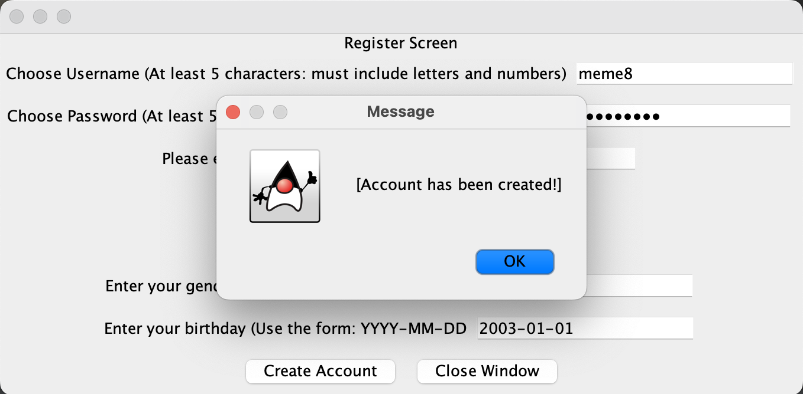

Click the `OK` button.
This will take you to the original login screen again. 

Now, you will be prompted to log in using the login information that you just created an account with:

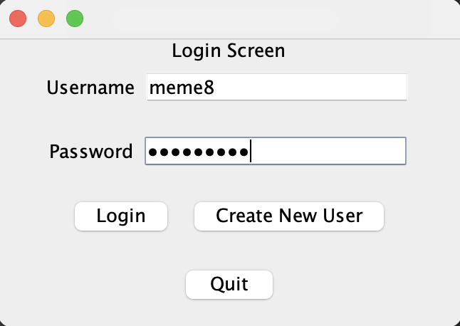

Click the `Login` button. 
If you entered your login information correctly and were successfully logged in, this message will pop up on your screen:

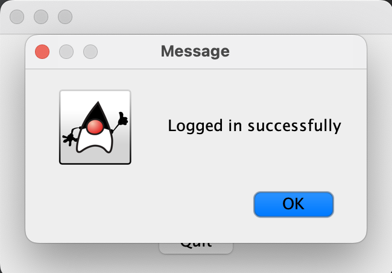

Click the `OK` button. 

Next, you will be taken to the Main Menu screen:

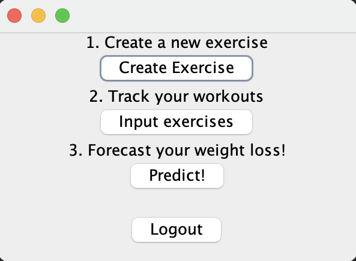

As you can see, our program has a few different features that you can play around with. 
First, you should create a couple of exercises for a more personalized experience.
Here's how to do that:

Under '*1. Create a new exercise*', click the `Create Exercise` button.
This will take you to the Exercise Creation screen:

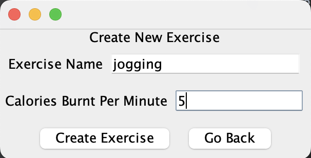

Here, enter the necessary information into the text fields provided:
1. **Exercise Name**: name of your custom exercise, be creative! This cannot be left empty.
2. **Calories Burnt Per Minute**: average number of calories that this exercise burns per minute, this cannot be left empty.

Click the `Create Exercise` button to create this exercise for your account. Now, you can use this exercise to track your fitness!
If the exercise was created successfully, this message will pop up:

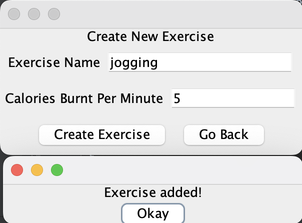

You can close this message. 
If you want, you can continue to add more exercises.
Once you are done, click the `Go Back` button to return to the Main Menu screen. 

Next, under '*2. Track your workouts*', click the `Input exercises` button.
This will take you to the Data Input screen:

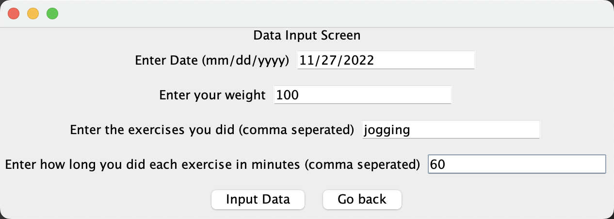

Here, you can enter your fitness information for a given day. 
You must enter:
1. **Date**: in the format mm/dd/yyyy.
2. **Weight**: for that date, will be used in health calculations.
3. **Exercises**: exercises you completed on that date, must be comma separated. 
4. **Length of Exercises**: number of minutes you completed those exercises for, must be comma separated. 

Then, click the `Input Data` button to add this data to your account.
If your data was inputted successfully, this message will pop up:

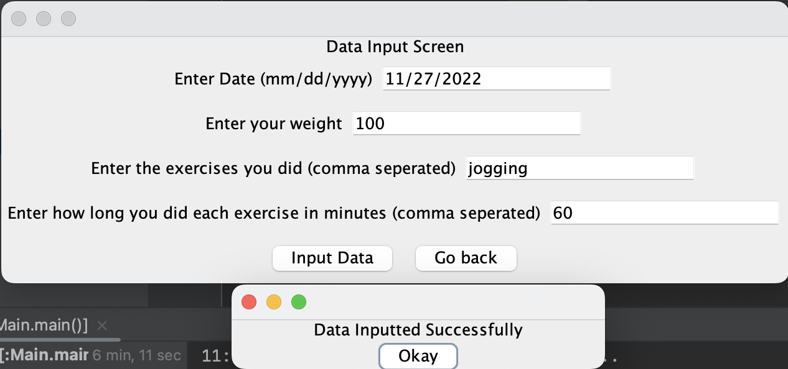

Next, under '*3. Forecast your weight loss!*', you can click the `Predict!` button. 
This will take you to the Dashboard screen, which uses the Predictions feature:

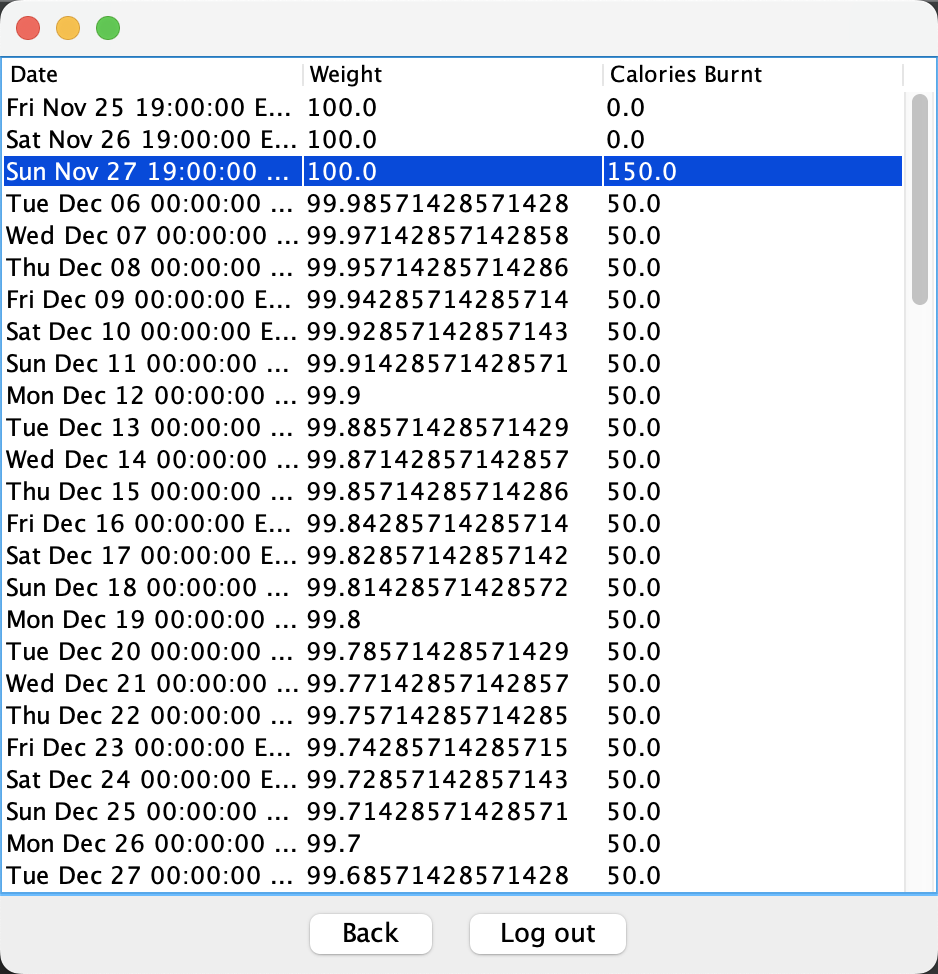

Your fitness journey for the next 90 days will be forecasted and mapped on a table. 

Have fun with this!

